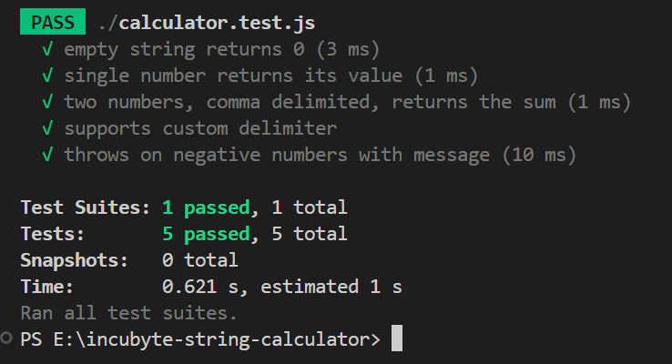

# Incubyte String Calculator (TDD Kata)

## Project Overview

This project implements a simple String Calculator as a part of the Incubyte TDD Assessment. The goal is to practice Test Driven Development (TDD) using JavaScript and Jest. The calculator can add numbers given in a string format, supporting requirements as they are introduced incrementally through tests.

---

## How to Run the Code and Tests

1. **Clone the repository**
   ```bash
   git clone https://github.com/RushangG/string-calculator-tdd.git
   cd string-calculator-tdd
   ```

2. **Install dependencies**
   ```bash
   npm install
   ```

3. **Run tests**
   ```bash
   npm test
   ```

---

## Description of My TDD Process

1. I started by writing the first test for the simplest requirement (e.g., empty string returns 0).
2. I wrote just enough code to make the test pass.
3. I refactored the code if necessary, ensuring all tests still pass.
4. I then added the next test covering a new requirement (e.g., one number, two numbers, custom delimiters, etc.).
5. I repeated this cycle, letting the tests drive the design and ensuring each new feature had corresponding tests before implementation.
6. This process continued until all requirements were satisfied and the codebase was fully tested.

---

## Screenshot of Passing Tests

Below is a screenshot showing all tests passing in VS Code:



---

Feel free to reach out if you have any questions!
