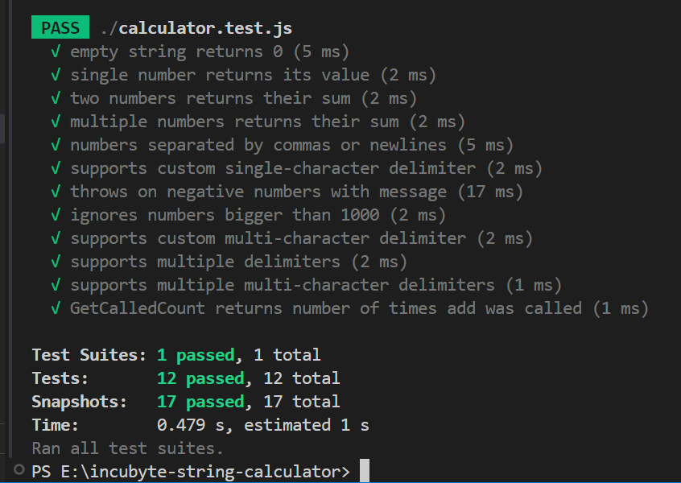

# Incubyte String Calculator (TDD Kata)

## Project Overview

This project implements a robust String Calculator as part of the Incubyte TDD Assessment. The goal is to practice Test Driven Development (TDD) using JavaScript and Jest, demonstrating clean code, maintainability, and professionalism.

---

## Why JavaScript & Jest?

I chose **JavaScript** because it is versatile, beginner-friendly, and widely used for both front-end and back-end development. It allows rapid prototyping and clear demonstration of algorithms.

**Jest** was selected for its simplicity, powerful features (like snapshot testing and built-in mocks), and its suitability for TDD and high code quality.

---

## What is TDD & Why is it Important?

**Test Driven Development (TDD)** is a software development approach where you write tests *before* implementing code. This ensures:
- Code is thoroughly tested from the start.
- Requirements are clear and met.
- Refactoring is safe and easy.
- Code quality and maintainability are improved.

---

## Approach to Code Quality

- **Readable:** Simple, descriptive function and variable names.
- **Maintainable:** Modular code with clear separation of concerns.
- **Well-tested:** All edge cases covered with meaningful test names.
- **Consistent:** ESLint used for code style and formatting.

---

## Features

- Returns `0` for an empty string input.
- Returns the number itself if only one number is provided.
- Adds numbers separated by commas or newlines.
- Supports any amount of numbers.
- Supports custom single or multi-character delimiters (e.g., `//;\n1;2`, `//[***]\n1***2***3`).
- Supports multiple delimiters (e.g., `//[*][%]\n1*2%3`, `//[***][%%]\n1***2%%3`).
- Ignores numbers greater than 1000 (`2,1001` returns `2`).
- Throws an exception if negative numbers are provided, listing all negative numbers in the error message.
- Tracks how many times the `add()` method is called (`getCalledCount()`).
- **Extensive test cases:** All advanced and edge conditions covered, including custom delimiter syntax, multiple and multi-character delimiters, negative number checks, and numbers > 1000.

---

## Getting Started

### 1. Clone the repository
```bash
git clone https://github.com/RushangG/string-calculator-tdd.git
cd string-calculator-tdd
```

### 2. Install dependencies
```bash
npm install
```

### 3. Run linting
```bash
npm run lint
```

### 4. Run tests
```bash
npm test
```

> **Note:** Snapshot tests are included and up-to-date.  
> If you change logic or add outputs, update snapshots with:
> ```bash
> npm test -- -u
> ```

---

## Usage Example

```js
const { StringCalculator } = require('./calculator');
const calc = new StringCalculator();

console.log(calc.add("")); // 0
console.log(calc.add("1")); // 1
console.log(calc.add("1,2")); // 3
console.log(calc.add("1\n2,3")); // 6
console.log(calc.add("//;\n1;2")); // 3
console.log(calc.add("//[***]\n1***2***3")); // 6
console.log(calc.add("//[*][%]\n1*2%3")); // 6
console.log(calc.add("//[***][%%]\n1***2%%3")); // 6
console.log(calc.add("2,1001")); // 2
console.log(calc.getCalledCount()); // 9
```

---

## Test Coverage

The solution is thoroughly tested with Jest, including snapshot testing. Covered scenarios include:

- Empty string input
- Single number input
- Two and multiple numbers (comma or newline delimited)
- Custom single-character delimiters
- Custom multi-character delimiters
- Multiple delimiters (including multi-character and combinations)
- Numbers greater than 1000 ignored
- Negative numbers throw errors listing all negative values
- `getCalledCount()` method
- **All new and advanced edge cases are covered in the updated test suite**

See all test cases in [`calculator.test.js`](./calculator.test.js).

---

## Passing Tests Screenshot

Below is a screenshot showing all tests passing in VS Code:



---

## Code Quality & Linting

- The codebase follows best practices, with ESLint configured for consistency.
- JSDoc comments are included for main functions.

---

## About Me

Hi! I’m Rushang Gajera, a passionate developer who loves clean code and learning new things.  
- [Email](mailto:gajerarushang17@gmail.com)

---

**Thank you for reviewing my assignment! I look forward to your feedback.**